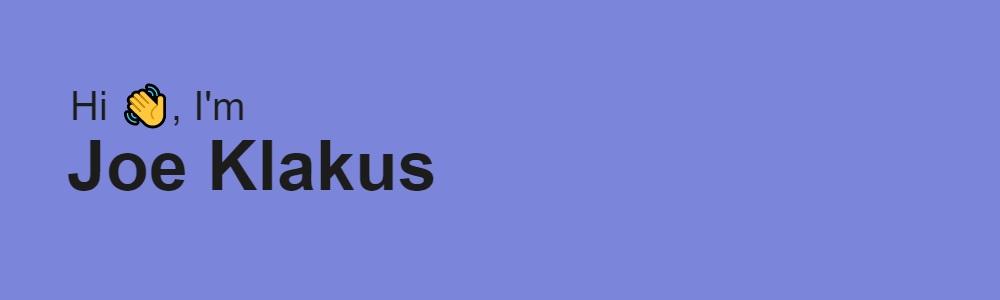

<h2>“I am an JavaScript Full Stack Web Developer”</h2>

Hi there! I am a self-motivated and adaptable individual with a passion for technology and the web. I am constantly seeking to expand my knowledge and develop new skills in areas such as sustainability, social impact, and emerging technologies.

As a web developer, I have experience building web apps, along with video editing and content writing. Outside of coding, I enjoy playing guitar, cooking, and scuba diving, and have volunteered with conservation projects involving turtles and coral restoration. With a strong foundation in programming logic and a focus on JavaScript, including ES2015 syntax and TypeScript, I am skilled in using modern software engineering practices such as jest, cypress, and react-testing to ensure high-quality code. I am also experienced in using git for version control and collaboration with other developers.

As a creative and efficient thinker with strong communication skills, I am confident in my ability to work effectively on a team, especially in a remote setting. I am dedicated to going above and beyond to ensure that I am a valuable asset to any team and am excited to continue expanding my skills in the tech industry.

[View my portfolio site](https://jklakus.live)

<h2>Education</h2>

 • School of Code cohort 12 16 week bootcamp 

 • Responsive Web Design freecodecamp.org

 • CS50 Online certification, Harvard

<h3 align="left">Languages & Tools</h3>

I am currently looking for a junior 
developer role that will allow me to learn 
new technologies and progress in my 
career.

I enjoy self developing and have been 
freelancing making websites along with 
video editing and content writing.

Outside of coding i enjoy playing guitar, 
cooking & scuba diving. 

